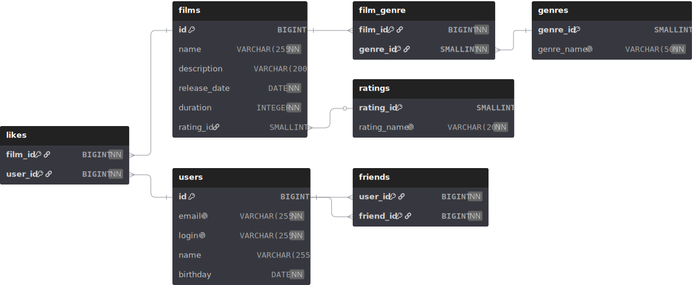

# Схема базы данных Filmorate

## Описание схемы

База данных состоит из следующих основных таблиц:

*   **users** — хранит информацию о пользователях системы (ID, email, логин, имя, дата рождения).
*   **films** — содержит данные о фильмах (название, описание, дата выхода, длительность, ссылка на рейтинг).
*   **ratings** — справочник возрастных рейтингов фильмов.
*   **genres** — справочник доступных жанров кино.
*   **film_genre** — связующая таблица "многие ко многим" между фильмами и жанрами.
*   **likes** — таблица для учета лайков пользователей к фильмам.
*   **friends** — таблица для хранения связей между пользователями (дружба).

## Справочник рейтингов

*   **G** — у фильма нет возрастных ограничений,
*   **PG** — детям рекомендуется смотреть фильм с родителями,
*   **PG-13** — детям до 13 лет просмотр не желателен,
*   **R** — лицам до 17 лет просматривать фильм можно только в присутствии взрослого,
*   **NC-17** — лицам до 18 лет просмотр запрещён.

## Справочник жанров

*   Комедия
*   Драма
*   Мультфильм
*   Триллер
*   Документальный
*   Боевик

## Примеры запросов

### Фильмы
| Метод  | Путь                        |
|--------|-----------------------------|
| GET    | `/films`                    |
| GET    | `/films/{id}`               |
| GET    | `/films/popular`            |
| POST   | `/films`                    |
| PUT    | `/films`                    |
| PUT    | `/films/{id}/like/{userId}` |
| DELETE | `/films/{id}`               |
| DELETE | `/films/{id}/like/{userId}` |

### Пользователи
| Метод  | Путь                                       |
|--------|--------------------------------------------|
| GET    | `/users`                                   |
| GET    | `/users/{id}`                              |
| GET    | `/users/{id}/friends`                      |
| GET    | `/users/{userId}/friends/common/{otherId}` |
| POST   | `/users`                                   |
| PUT    | `/users`                                   |
| PUT    | `/users/{userId}/friends/{friendId}`       |
| DELETE | `/users/{userId}/friends/{friendId}`       |

### Дополнительные ресурсы
| Метод | Путь                |
|-------|---------------------|
| GET   | `/mpa`              |
| GET   | `/mpa/{mpaId}`      |
| GET   | `/genres`           |
| GET   | `/genres/{genreId}` |
